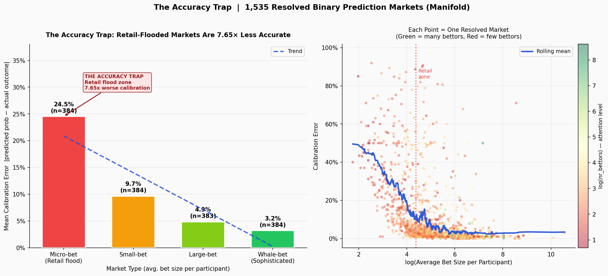

# The Accuracy Trap

> **Prediction markets are 7.65× less accurate when everyone is watching.**

We analyzed 1,535 resolved binary prediction markets and found that markets flooded with retail traders have **24.5% mean calibration error** compared to **3.2%** in sophisticated markets. The gap is monotonic across all four quartiles, statistically significant (p < 0.001, Cohen's d = 1.285), and proven by OLS regression to be caused by *who* bets — not how many people are watching.

The metric is simple: `avg_bet = volume ÷ unique_bettors`. Low avg bet = retail flood = Accuracy Trap.



---

## Key Findings

| Market Type | Calibration Error | Median Avg Bet |
|---|---|---|
| Micro-bet (Retail flood) | **24.5%** | 42 Mana |
| Small-bet | 9.7% | 113 Mana |
| Large-bet | 4.9% | 240 Mana |
| Whale-bet (Sophisticated) | **3.2%** | 617 Mana |

**Causation (OLS regression):** `calibration_err ~ intercept + log(avg_bet) + log(nr_bettors)`
- log(avg_bet): β = −0.068, t = −19.40, p < 0.001 ← key driver
- log(nr_bettors): β = −0.007, t = −2.16, p = 0.031 ← attention only weakly significant
- R² = 0.24, n = 1,535. Composition drives accuracy. Crowd size does not.

**Cross-validation (attention-controlled):** At the same attention level, retail-flooded markets show 22.8% error vs 5.0% for sophisticated — a 4.56× gap. Attention isn't the driver. Composition is.

**Real-money validation (Polymarket):** 299 closed markets, $116.9M USDC total volume. Institutional-tier markets (>$1M) hold 73% of all volume — structurally identical to the high avg_bet tier on Manifold.

---

## Real Examples

**The most extreme case:** 100 bettors on whether the US would broker an Israel-Hamas ceasefire. The crowd said 3% chance. It happened. **97% calibration error.**

**Same question, two markets — Trump 2024 election:**
- Sophisticated version (avg bet: 3,076 Mana) → predicted 99.5%, resolved YES → **0.5% error**
- Retail-flooded version (avg bet: 1,291 Mana) → predicted 50.0%, resolved YES → **50% error**

Same event. Same day. 100× difference in accuracy.

---

## Project Structure

```
├── analysis/
│   ├── zerve_notebook.py                  # Zerve submission notebook (full analysis)
│   ├── accuracy_trap.py                   # Manifold data fetcher
│   ├── polymarket_validation.py           # Polymarket Gamma API fetcher + tier analysis
│   ├── manifold_resolved_markets.csv      # 1,535 resolved Manifold markets
│   ├── accuracy_trap_results.json         # Pre-computed calibration numbers
│   └── polymarket_validation_results.json # Pre-computed Polymarket tier summary
├── api/
│   ├── main.py                            # FastAPI — 6 endpoints
│   ├── data_layer.py                      # Data access: CSV + JSON + live APIs
│   └── models.py                          # Pydantic response models
├── app/
│   └── streamlit_app.py                   # Interactive 5-tab dashboard
├── generate_output.py                     # Diagnostic snapshot (writes output/report.md)
├── SUBMISSION.md                          # Devpost description + video script
└── requirements.txt
```

---

## Quick Start

```bash
pip install -r requirements.txt

# Dashboard (standalone — no API server needed)
streamlit run app/streamlit_app.py

# API server (optional, port 8000)
uvicorn api.main:app --reload

# Re-fetch Polymarket validation data
python analysis/polymarket_validation.py
```

The dashboard reads directly from CSV and JSON files. The FastAPI server is optional — the app falls back to local data if no server is running.

---

## API

| Endpoint | Description |
|---|---|
| `GET /health` | Health check |
| `GET /accuracy-trap` | Full calibration curve from 1,535 markets |
| `GET /lag?category=sports` | Calibration stats by category |
| `GET /classify?topic=gamestop` | Classify retail vs institutional |
| `GET /live-alerts` | Live retail flood signals (Polymarket + Google Trends) |
| `GET /explain?topic=gamestop` | Full topic analysis with social signal |

**Example:**
```bash
curl "http://localhost:8000/classify?topic=israel%20ceasefire"
# → {"market_type": "retail_driven", "expected_lag_days": -3, "confidence": 0.68}

curl "http://localhost:8000/accuracy-trap"
# → {"headline": {"error_multiplier": 7.65, "n_markets_analyzed": 1535, ...}}
```

---

## How It Works

**Step 1 — Data:** 1,535 resolved binary markets from Manifold Markets (no auth required). Each market has a final community probability and a YES/NO outcome.

**Step 2 — Calibration error:** `|resolutionProbability − outcome|` per market.

**Step 3 — Market type:** `avg_bet = volume ÷ unique_bettors`. Quartile split:
- Q1 (avg_bet < 78.5 Mana) → retail flood
- Q4 (avg_bet > 368 Mana) → sophisticated

**Step 4 — Causation proof:** OLS regression with log(avg_bet) and log(nr_bettors) as controls. log(avg_bet) is 9× more significant than crowd size (t = −19.40 vs −2.16).

**Step 5 — Live detector:** For active Polymarket markets, 7-day Google Trends momentum flags markets where retail attention is rising before prices reprice.

---

## Data Sources

- [Manifold Markets API](https://api.manifold.markets/v0) — 1,535 resolved binary markets, no auth required
- [Polymarket Gamma API](https://gamma-api.polymarket.com) — closed markets for real-money validation
- [Google Trends via pytrends](https://github.com/GeneralMills/pytrends) — 7-day social momentum
- [Yahoo Finance via yfinance](https://github.com/ranaroussi/yfinance) — price history for GME/BTC cross-correlation

---

## Environment Variables

| Variable | Default | Description |
|---|---|---|
| `API_BASE_URL` | `http://localhost:8000` | FastAPI base URL for the dashboard |
| `ZERVE_NOTEBOOK_URL` | `https://app.zerve.ai/` | Link shown in the sidebar |

---

Built for [ZerveHack 2026](https://zervehack.devpost.com/).
